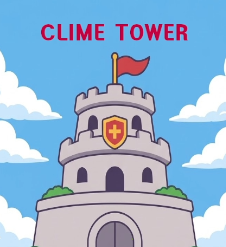
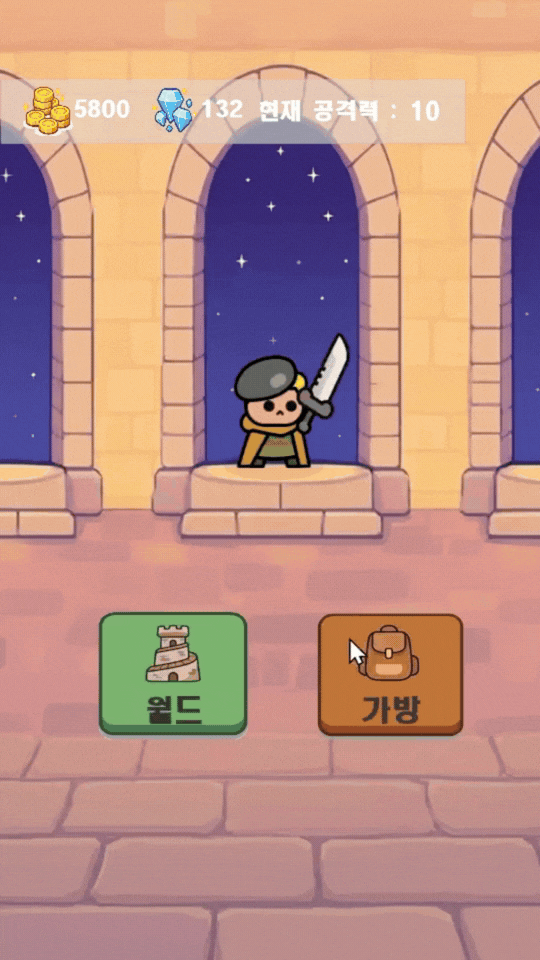

# Unity 2D Action Game (개인 프로젝트)

## ■ 개요
- 출시작 '타워 브레이커'의 코어 루프를 분석하여 Unity로 프로토타입 재현한 프로젝트입니다.
- 클라이언트 환경에서의 플레이 조작감, 타격감 연출, 그리고 '전투-보상-성장'으로 이어지는 핵심 게임 사이클 구현에 집중했습니다.

## ■ 개발 환경
- **언어:** C#
- **개발 도구:** Unity Engine, Visual Studio 2022
- **플랫폼:** PC (Windows Standalone) / Mobile (Android 지원 설계)

## ■ 시연 영상

  
   
  <b>(이미지를 클릭하면 유튜브 시연 영상으로 이동합니다)</b>

## ■ 프로젝트 구조 및 주요 소스코드
<pre>
📂 <b>Assets</b>
└── 📂 <b>Scripts</b>
    ├── 📂 <b>LogoScene</b>
    │   └── <a href="./Assets/Scripts/LogoScene/GameDataManager.cs">GameDataManager.cs</a> (싱글톤 기반 전역 데이터 및 재화 관리)
    ├── 📂 <b>MainScene</b>
    │   ├── 📂 <b>Player</b>
    │   │   ├── <a href="./Assets/Scripts/MainScene/Player/PlayerController.cs">PlayerController.cs</a> (플레이어 이동 및 조작 입력 처리)
    │   │   ├── <a href="./Assets/Scripts/MainScene/Player/PlayerCombat.cs">PlayerCombat.cs</a> (공격/방어 및 스킬 시퀀스 제어)
    │   │   └── <a href="./Assets/Scripts/MainScene/Player/PlayerStats.cs">PlayerStats.cs</a> (캐릭터 능력치 및 상태 관리)
    │   └── 📂 <b>Inventory</b>
    │       ├── <a href="./Assets/Scripts/MainScene/Inventory/InventoryManager.cs">InventoryManager.cs</a> (인벤토리 시스템 메인 로직)
    │       └── 📂 <b>Items</b>
    │           └── <a href="./Assets/Scripts/MainScene/Inventory/Items/ItemSlot.cs">ItemSlot.cs</a> (개별 아이템 슬롯 UI 및 상호작용)
    └── 📂 <b>BattleScene</b>
        ├── 📂 <b>Monster</b>
        │   ├── <a href="./Assets/Scripts/BattleScene/Monster/MonsterParent.cs">MonsterParent.cs</a> (몬스터 공통 로직 추상 클래스)
        │   ├── <a href="./Assets/Scripts/BattleScene/Monster/FlockingManager.cs">FlockingManager.cs</a> (군집 대열 중앙 제어 시스템)
        │   ├── 📂 <b>MonsterSkull</b>
        │   │   └── <a href="./Assets/Scripts/BattleScene/Monster/MonsterSkull/MonsterSkull.cs">MonsterSkull.cs</a> (해골 몬스터 AI)
        │   ├── 📂 <b>MonsterGoblin</b>
        │   │   └── <a href="./Assets/Scripts/BattleScene/Monster/MonsterGoblin/MonsterGoblin.cs">MonsterGoblin.cs</a> (고블린 몬스터 AI)
        │   └── 📂 <b>MonsterSlime</b>
        │       └── <a href="./Assets/Scripts/BattleScene/Monster/MonsterSlime/MonsterSlime.cs">MonsterSlime.cs</a> (슬라임 몬스터 AI)
        └── 📂 <b>Boss</b>
            ├── 📂 <b>BossSkull</b>
            │   └── <a href="./Assets/Scripts/BattleScene/Boss/BossSkull/BossSkull.cs">BossSkull.cs</a> (해골왕: 광역 참격 패턴)
            └── 📂 <b>BossGoblin</b>
                └── <a href="./Assets/Scripts/BattleScene/Boss/BossGoblin/BossGoblin.cs">BossGoblin.cs</a> (고블린왕: 방어 기믹 파훼 패턴)
</pre>

---

## ■ 주요 구현 기능

### 1. 군집 대열 시스템 (Flocking System)
- **중앙 제어 최적화:** 개별 몬스터의 연산 부하를 줄이기 위해 `FlockingManager`가 대열 전체의 이동량을 관리합니다.
- **대열 유지:** 다수의 몬스터가 등장해도 일정 간격의 기차 대열을 유지하며 안정적으로 이동합니다.

| 군집 대열 이동 (Movement) |
| :---: |
|  |

### 2. 플레이어 액션 및 성장 시스템
- **컴포넌트 기반 설계:** 조작, 전투, 스탯 역할을 명확히 분리하여 유지보수성을 높였습니다.
- **인벤토리 연동:** 아이템 슬롯(`ItemSlot`) 인터페이스를 통해 장비를 실시간 장착/해제하고 캐릭터 정보에 반영합니다.

| 참격 스킬 (Blade) | 인벤토리/장비 (Inventory) |
| :---: | :---: |
|  |  |

### 3. 보스전 및 패턴 기믹
- **상속 기반 AI:** `MonsterParent`를 상속받아 코드 중복을 최소화하고 보스별 고유 기믹을 오버라이딩했습니다.

| 보스 패턴 기믹 (Boss2) |
| :---: |
|  |

### 4. 시각적 연출 및 스테이지 흐름
- **타격감 강화:** 피격 점멸, 데미지 텍스트, 역경직 연출로 액션성을 극대화했습니다.
- **스테이지 전환:** 층 전투 종료 후의 확대 연출 및 자연스러운 다음 층 스크롤링을 구현했습니다.

| 전투 종료 연출 (Clear) | 스테이지 이동 (Move) |
| :---: | :---: |
|  |  |

---

## ■ 핵심 역량 요약
- **시스템 최적화:** 상대 좌표 기반 중앙 제어로 다수 개체 이동 연산 효율 극대화
- **객체 지향 설계:** 추상 클래스와 컴포넌트화를 통한 확장성 있는 구조 구축
- **몰입감 있는 연출:** 코루틴 보간 및 애니메이션 이벤트를 활용한 액션 RPG 타격감 구현
